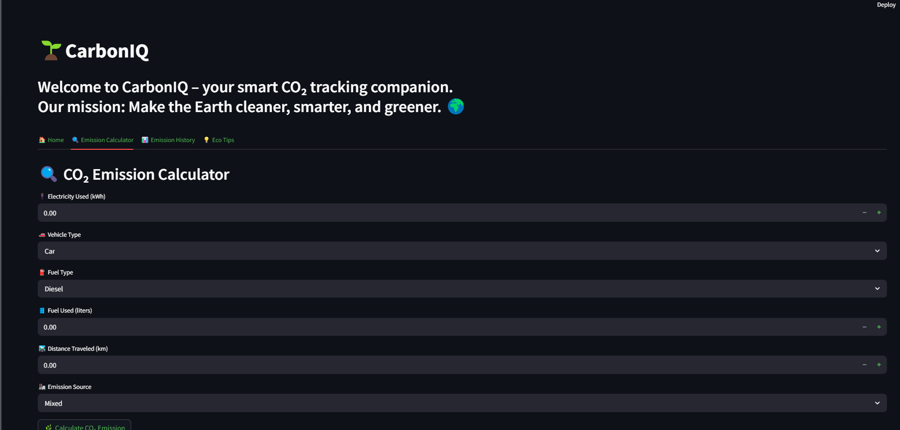

🌱 CARBONIQ
Climate change is one of the most pressing challenges of our time. With rising global temperatures, unpredictable weather patterns, and increasing carbon emissions, it has become more crucial than ever to take action—both individually and collectively. One of the most significant contributors to global warming is the emission of greenhouse gases, particularly carbon dioxide (CO₂), resulting from electricity usage, transportation, and industrial processes.

To empower individuals in their fight against climate change, we built CarbonIQ – an intelligent web application that allows users to estimate, monitor, and reduce their personal carbon footprint. Through real-time emission calculation, historical data visualization, and eco-friendly tips, CarbonIQ aims to create awareness and inspire change for a cleaner and greener planet.

## 🚀 Key Features

### 🔍 Real-Time Emission Calculator
Calculates your estimated CO₂ emissions based on your electricity usage, vehicle type, distance traveled, and fuel consumed.

### 📊 Emission History Tracker
Keeps a history of all your emission predictions and displays them with easy-to-understand graphs and data visualization.

### 💡 Eco-Friendly Tips
Get curated, personalized suggestions to reduce your carbon footprint and contribute to a greener planet.

### 🌱 Minimal UI & Clean Design
An intuitive, user-friendly interface built with **Streamlit** for a seamless experience.

---


## 📸 Screenshots

### 🏠 Home Page


### 🔢 Emission Calculator


### 📈 Emission Trends


---

## 🛠️ Tech Stack

- **Frontend/UI**: Streamlit
- **Machine Learning**: Scikit-learn
- **Backend**: Python
- **Data Storage**: CSV (Local logging for predictions)
- **Animation**: Lottie

## ⚙️ How to Run

1. **Clone the repository**
   ```bash
   git clone https://github.com/your-username/carboniq.git
   cd carboniq

